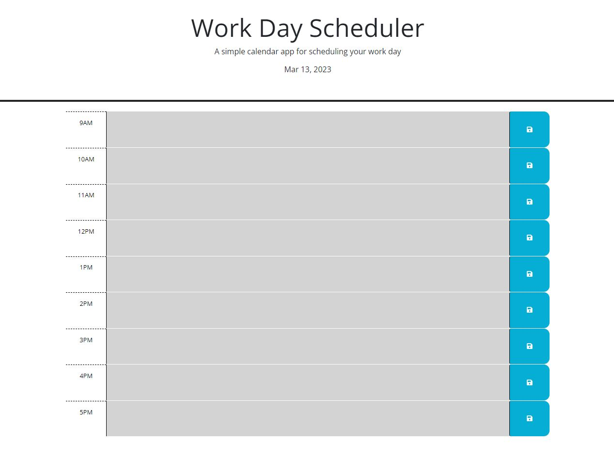
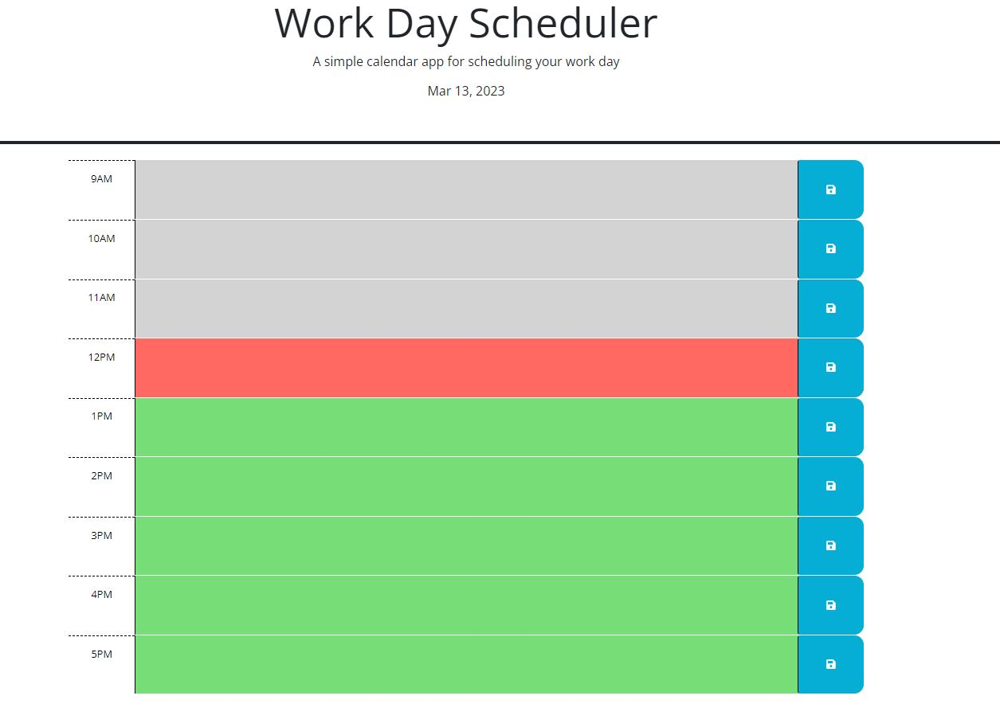
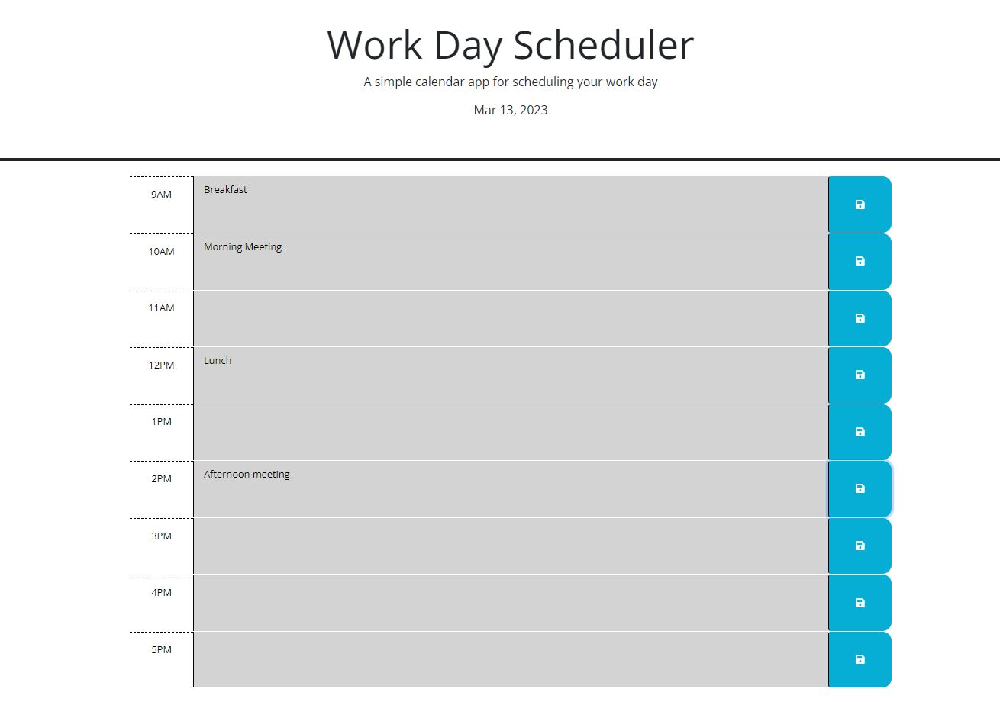

# Calendar

## Description

This is an calendar app a user can save their events day to day in, it will hold the entries within the local storage so the page can be refreshed and still save the information for each hour time window. Hour time block also change colors to let the user know what is current and what is in the past and future.

## Installation

Run the URL() and then type within the time slots to add events. Then select the floppy disc to the right to save event in that time block.

## Usage

Calendar

Calendar with colors

Calendar with events
